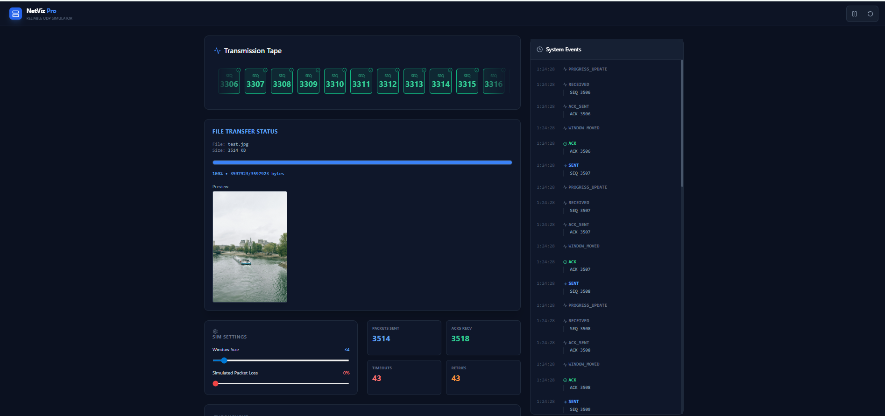
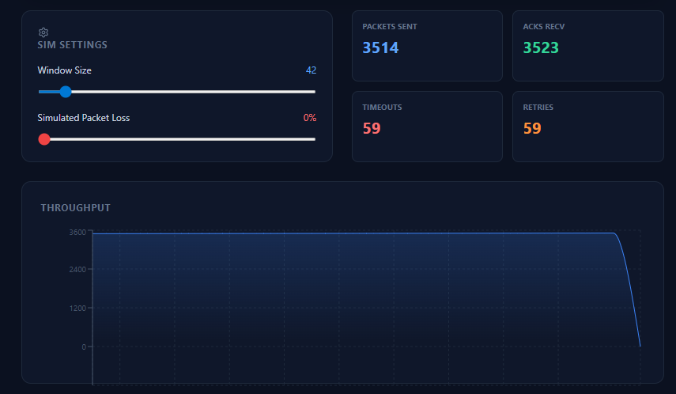
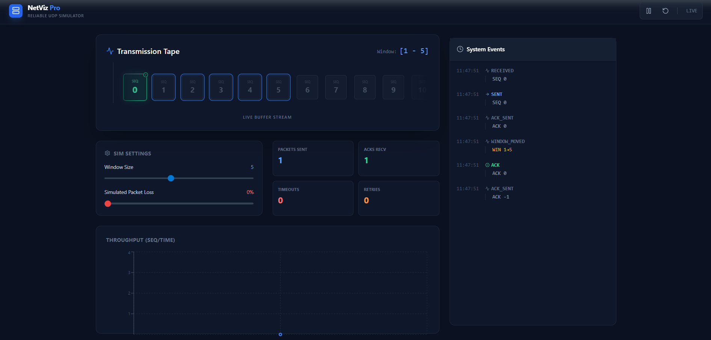

# NetViz Pro (v2.0) — Real-Time Reliable UDP Sliding Window Simulator

> **© M. Jagadeeswar Reddy 2025. All Rights Reserved.**

### 🎥 Watch the Live Demo (60s)
[](https://www.youtube.com/watch?v=VI89eRaECs0)

**[▶️ Click Here to Watch the Full Demo on YouTube](https://www.youtube.com/watch?v=VI89eRaECs0)**

---

### 🌟 v2.0 Dashboard: Binary File Transfer Mode
*New Features: Image/PDF support, Real-time Preview, Packet Loss Simulation, and Dynamic Window Resizing.*



### 🔹 v1.0 Dashboard: Basic String Transfer
*Original version demonstrating text-based packet simulation.*


## 🚀 Overview

**NetViz Pro** is an advanced full-stack Network Simulator that implements a **Binary-Safe Reliable Transport Protocol** over UDP.

Unlike the basic version (v1.0), **v2.0 supports real file transfers** (Images, PDFs, etc.) and simulates real-world network conditions like packet loss and dynamic window resizing. It visualizes the entire lifecycle of a file transfer—from binary segmentation to reconstruction—on a real-time dashboard.

This project integrates:
* **Java** → Core ARQ Engine (File I/O & Logic)
* **Node.js** → UDP → WebSocket Bridge
* **React (Vite) + TailwindCSS** → Visualization/UI
* **Recharts + Lucide** → Real-time telemetry

---

## ✨ Key Features (v2.0)

### 1. Hybrid Sliding Window ARQ (Java)
A custom protocol combining the best of Go-Back-N + Selective Repeat:
* **Supports out-of-order packet reception**
* **Uses cumulative ACKs** (like TCP)
* **Retransmits only missing packets**
* **Timeout detection + retry logic**
* **FIN handshake** for session closing
* **Checksum-based integrity validation**
* **Packet segmentation + reconstruction**

This design provides:
✔ High throughput
✔ Simplified ACK logic
✔ More realistic behavior
✔ Easier visualization

### 2. Binary File Transfer Protocol
The core engine has been upgraded to support arbitrary file types (**loaded via backend configuration**, rather than UI drag-and-drop):
* **Metadata Injection:** The first packet (Seq 0) carries the **Filename** and **File Size**.
* **Binary Segmentation:** Reads files byte-by-byte (not string-based) to ensure data integrity for images/PDFs.
* **Automatic Reconstruction:** The Receiver parses metadata, streams chunks to a buffer, and saves the file to disk upon completion.
* **Live Preview:** The dashboard displays the received image immediately upon completion.

### 3. Real-Time Visualization Dashboard (React + Tailwind)
The UI animates every network event:
* **Packet Sent** → Flying animation
* **ACK Received** → Green flash
* **Timeout** → Shake animation
* **Retransmission** → Bounce animation
* **Current sliding window** → Blue highlight box

**Plus graphs:**
* Throughput chart (SEQ vs. Time)
* Metrics dashboard (Sent, ACKs, Timeouts, Retries)
* Live log stream with timestamps

### 4. Interactive Simulation Controls
The dashboard allows real-time manipulation of the protocol:
* **Window Size Slider:** Dynamically resize the TCP Window (1-500) during transmission using UDP control packets.
* **Packet Loss Simulator:** Introduce artificial packet loss (0-50%) to observe retransmission behavior and window stalling.
* **Playback Control:** Pause, Resume, and Reset the visualization timeline.

### 5. Node.js UDP → WebSocket Bridge
A lightweight middleware relays Java events to the UI with zero delay:

| Java Event | Purpose |
| :--- | :--- |
| `FILE_START` | Initial metadata event (filename, size) |
| `PACKET_SENT` | Packet transmitted |
| `ACK_RECEIVED` | ACK processed |
| `TIMEOUT` | Packet assumed lost |
| `RETRANSMIT` | Missing packet resent |
| `WINDOW_MOVED` | Sender's window advanced |
| `FILE_COMPLETE` | File saved and ready for preview |

**Ports:**
* **UDP 5000** → Node receives events
* **WebSocket 3000** → Frontend listens live

---

## 🧠 System Architecture

```text
┌──────────────────┐       UDP:5000         ┌─────────────────────┐        WS:3000         ┌──────────────────────┐
│   Java ARQ Core  │  ─────────────────►  │      Node Bridge      │  ─────────────────►   │      React Dashboard     │
│ (Sender/Receiver) │                      │ (Static File Server)  │                      │ (File Preview UI)      │
└──────────────────┘  ◄──────────────────  └─────────────────────┘  ◄──────────────────  └──────────────────────┘
        ▲    │                                     ▲                                              │
        │    └─► Writes to 'received/' ────────────┘                                              │
        │                                                                                         │
        │  1. Metadata (Seq 0)           2. Binary Data Chunks           3. FIN (End of File)     │
        │  [Flag|NameLen|Name|Size]      [Raw Bytes.........]            [Type: FIN]              │
🧩 Technology Stack
Frontend
React (Vite)

TailwindCSS

Recharts (graphs)

Lucide Icons

Custom CSS Physics Animations

Middleware
Node.js

Express.js

Socket.IO

UDP Sockets (dgram)

Core Networking Engine
Java (JDK 17+)

Java NIO (FileChannel/ByteBuffer)

Custom ARQ protocol implementation

Manual packet framing + checksum

Byte-level packet handling

📁 Project Structure
Plaintext

NetViz/
│
├── Java_Core/              # Core ARQ Protocol
│   └── src/
│       ├── Sender.java
│       ├── Receiver.java
│       ├── WindowManager.java
│       ├── WindowControlListener.java  # Listens for UI Slider events
│       ├── Logger.java
│       ├── CustomPacket.java
│       ├── Utils.java
│       └── Main.java
│
├── Node_Bridge/            # UDP → WebSocket Bridge
│   ├── server.js
│   ├── received/           # Stores transferred files
│   └── package.json
│
└── Frontend_UI/            # Visualization Layer (React + Tailwind)
    ├── src/
    │   ├── App.jsx
    │   ├── index.css
    │   └── main.jsx
    ├── index.html
    └── package.json
🛠 How to Run the Project
1️⃣ Start Node Bridge
Listens for logs and serves the received files for preview.

Bash

cd NetViz/Node_Bridge
node server.js
Output: ✅ UDP Bridge listening... 📡 Serving received files...

2️⃣ Start the React Dashboard
Launches the visualization interface.

Bash

cd NetViz/Frontend_UI
npm install
npm run dev
Open the dashboard at: http://localhost:5173

3️⃣ Run Java ARQ Protocol
Make sure you have a test file (e.g., test.png) referenced correctly in Main.java.

Bash

cd NetViz/Java_Core/src
javac *.java
java Main
Example output:

Plaintext

SENDER STARTED FILE TRANSMISSION
[SENDER] Sending File: test.png
...
FIN sent
Receiver ACKed FIN
✅ Saved file to: .../Node_Bridge/received/test.png
Meanwhile, the dashboard visualizes:

Packet movement

ACK waves

Timeout pulses

Window sliding

Real-time file progress bar & image preview

📬 Contact
Built by M. Jagadeeswar Reddy.